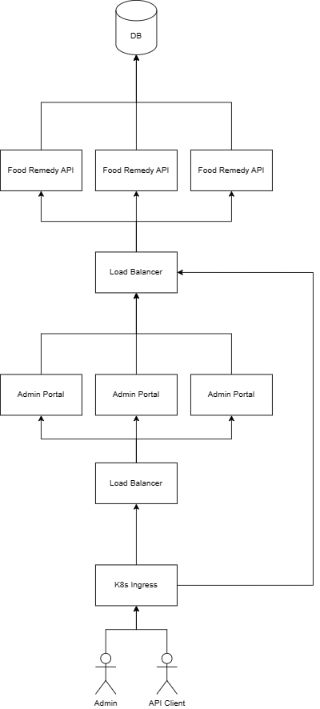

# Project Handover Document
**Company**: Gopher Industries

**Project**: Food Remedy

*Trimester 3, 2023*
## Table of Contents
- [Project Information](#project-information)
    - [Company Acting Director](#company-acting-director)
    - [Project Team](#project-team)
- [Project Overview](#project-overview)
- [User Manual](#user-manual)
- [Completed Deliverables](#completed-deliverables)
- [Roadmap](#roadmap)
- [Open Issues](#open-issues)
- [Lessons Learned](#lessons-learned)
- [Product Development Life Cycle](#product-development-life-cycle)
    - [New Tasks](#new-tasks)
    - [Definition of Done](#definition-of-done)
    - [Task Review](#task-review)
    - [Testing](#testing)
    - [Branching Strategy](#branching-strategy)
- [Production Architecture](#production-architecture)
    - [UML Diagram](#uml-diagram)
    - [Tech Stack](#tech-stack)
- [Source Code](#source-code)
- [Other Relevant Information](#other-relevant-information)
- [Appendices](#appendices)

## Project Information
### Company Acting Director
Dr. Bahareh Nakisa

bahar.nakisa@deakin.edu.au
### Project Team
|Name|Role|
|---|---|
|Jyhe Mark|Project Lead, Backend Lead|
|Ammar Farooq|Co-Lead, Frontend Lead|
|Cameron Frank Wator|UI / UX Design|
|Navodya Peiris|UI / UX Design|
|Sami Ullah|UI / UX Design|
|Negar Sadeghpour|UI / UX Design|
|Anshuman Bishnoi|UI / UX Design|
|Jinxuan Shao|UI / UX Design|
|Emily Merchant|Cloud Tech|
## Project Overview
The Food Remedy API is a project Gopher is developing in collaboration with industry partner FoodRemedy Co.

The project is an API which serves wholefood and related data such as nutritional information, vitamin / mineral make-up, and other related properties.

The project is a combination of a backend API application and a front end web app which serves as the admin portal for data and user management.

The project is being developed with the goal of going to market.
## User Manual
As the project is not currently deployed to a live environment, you will need to run the project on your local machine.

Please see readme files contained in [frontend](https://github.com/Gopher-Industries/foodremedy-web) and [backend](https://github.com/Gopher-Industries/foodremedy-api) repos respectively for further instructions and how to run the project.

Alternatively, if you have access to a Kubernetes cluster, you can also deploy the helm chart. Please see the repo readme [here](https://github.com/Gopher-Industries/foodremedy-chart) for further instructions.

## Completed Deliverables

The primary deliverables for this project are:
- The backend API application
- The front end admin portal web app

Both of these projects are still under active development, therefore no delivarables are officially completed.

However, the backend application is close to MVP state. We expect some quality of life changes and bug fixes to be identified once user testing starts, however we require further development on the admin portal before this can truly begin.

## Roadmap

- [x] Initial requirements gathering
- [x] Database technology investigation
- [x] Choosing a tech stack
- [ ] Major view UI / UX mock up design
    - [x] Login
    - [x] Landing page
    - [ ] Data management
    - [x] User management
- [x] Primary development on back end
    - [x] User authentication
    - [x] Ingredient management endpoints
    - [x] Dynamic tagging system
- [x] Deployment plan
    - [x] Containerisation of apps
    - [x] Kubernetes configuration
- [ ] Primary development on front end
    - [x] Functioning placeholder views
    - [ ] Final styling based on mock ups
- [ ] Iterative development of back end to support front end
- [ ] User testing
- [ ] Deployment
    - [ ] Database deployment
- [ ] Delivery

## Open Issues

There are currently no open issues that are blocking development of this project.

## Lessons Learned

- People management is key. Ensure that all parties involved on a ticket are in communication with each other. There is no point having all UI / UX resources dedicated to a single ticket when there are several tickets that need work.
- Stay on top of the Trello board. Ensure the listed tickets contain the required information, and be quick to clean up low quality or duplicate tickets.

## Product Development Life Cycle
### New Tasks

New tasks are added to the Food Remedy Trello board as they are required. These may be identifed through the project lead, or perhaps they are suggested tasks that have arisen from team collaboration and communication.

Regular team meetings are helpful to identify areas that need work, however they are not required. As long as the team maintains open communication channels in the Teams channel then issues can be collaborated on.

### Definition of Done

A task is considered done when it meets the requirements of the associated Trello ticket at an acceptable quality.

In the example of a technical contribution, the task would be considered done when the needs of the Trello card are met, a pull request has been created, reviewed by other team members, and finally merged into the main branch.

### Task Review

Technical contributions to a code base go through code review facilitiated by Githubs Pull Request feature. Changes are committed and pushed to a seperate branch, and then a Pull Request is opened. The changes are not merged into the main branch before getting reviewed and approved by another member.

In the case of requested changes, these must be completed before the merge can take place.

In the case of mockup designs, these are generally reviewed by multiple people on the team. During T3 this was primarily the project lead and the front end lead.

Going forward, this does not need to be the case, however it is important that the reviewer understands the intentions behind the design and what requirements it should meet, and not just approve a design because it looks nice.

### Testing

The project has different levels of testing.

During development, the developer should be testing underway to ensure the changes meet the requirements.

On top of manual developer testing, we also maintain a suite of automated tests that can be run to confirm the behaviour of the application and ensure that everything works as intended.

Once the front end web app is in a more mature state, we can begin QA and user testing. We have been thus far unable to achieve this, but I expect this can begin in the next trimester if focus is made to complete the web app.

### Branching Strategy

When a contributor picks up a new ticket, they should create a new branch for that feature or change.

The contributer should commit all of their changes only to their branch. When they are ready to complete the ticket, a Pull Request can be created on Github where the change can be reviewed.

Finally, the changes can be merged to the master branch, using the "Rebase and merge" strategy. Ideally, the contribute should also squish their commits into a single commit representing the change they made.

This helps us to keep our master branch commit history tidy.

## Production Architecture
### UML Diagram

### Tech Stack

**Backend**: .Net was chosed for the backend as it is an enterprise ready language with massive community support and a fantastic, cross-platform ecosystem.

**Front end**: Angular was chosed for our front end web-app as there was familiarity amongst the team. Originally we had chose React for our front end technology, however no meaningful progress was being made.

**Database**: We do not currently have an independantly deployed database. The API application, for development purposes, deploys with a self contained Sqlite database. This is intended to support development. The current top contender for stand alone DB tech is MySql.

**Infrastructure**: Google Cloud Platform, Kubernetes, Helm

## Source Code

All source code repositories are hosted on Github under the Gopher org. To access them, you just need to be on-boarded to Gopher.

- [Food Remedy API](https://github.com/Gopher-Industries/foodremedy-api)
- [Food Remedy Web](https://github.com/Gopher-Industries/foodremedy-web)
- [Food Remedy Chart](https://github.com/Gopher-Industries/foodremedy-chart)

## Other Relevant Information

This project is being work on in collaboration with Food Remedy Co.
Our industry contact at Food Remedy is Shura Ford. She currently has access to the Food Remedy channel on the Gopher Teams chat, and she can be contacted there.

## Appendices
- [Proposed goals for T3](https://deakin365.sharepoint.com/:b:/r/sites/GopherIndustries2/Shared%20Documents/Food%20Remedy%20Weekly%20Meeting%20Channel/Food-Remedy-API-T3-Proposal%203.pdf?csf=1&web=1&e=LxTFL3)

- [UI / UX View proposals](https://deakin365.sharepoint.com/:b:/r/sites/GopherIndustries2/Shared%20Documents/Food%20Remedy%20Weekly%20Meeting%20Channel/Food_Remedy_UXUI_Proposal_T3_2023.pdf?csf=1&web=1&e=GvggaE)

- [End of T3 Presentation](https://deakin365.sharepoint.com/:b:/r/sites/GopherIndustries2/Shared%20Documents/Food%20Remedy%20Weekly%20Meeting%20Channel/FoodRemedy_EoT3.pdf?csf=1&web=1&e=brGtAY)